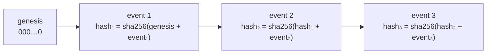

# Chain of custody

## Requirements

- Every handover of a consignment is recorded: warehouse → driver, driver → hub, hub → consignee.
- A record contains: time, from, to, location, person who signed.
- Records are **append-only**. Corrections are new records that reference the corrected one.
- It must be possible to prove that no record was altered after the fact (customer audit finding, April 2025).

Design: see [ADR 0003](adr/0003-custody-chain-hashing.md). Example response: [custody-chain.json](../api/examples/custody-chain.json).

## How the chain works

Changing, removing or reordering any past event changes its hash and breaks every hash after it.

## Verification procedure for auditors

1. Request `GET /shipments/{reference}/custody` for the sampled shipment.
2. Check `intact: true`. If `false`, `broken_at` gives the index of the first inconsistent event.
3. Compare the events with the signed paper delivery notes (random sample of 20 per audit).
4. Record the result in the audit evidence pack (`gdp-compliance-docs/audits/`).
