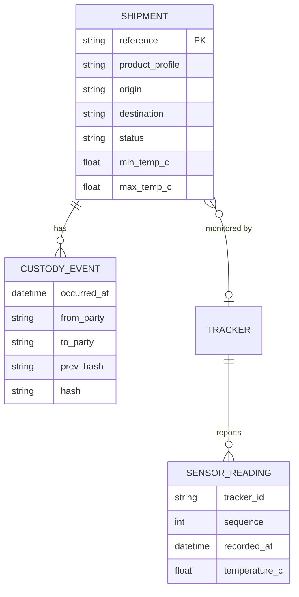

# Data model

```mermaid
erDiagram
    SHIPMENT ||--o{ CUSTODY_EVENT : "has"
    SHIPMENT }o--o| TRACKER : "monitored by"
    TRACKER ||--o{ SENSOR_READING : "reports"

    SHIPMENT {
        string reference PK
        string product_profile
        string origin
        string destination
        string status
        float min_temp_c
        float max_temp_c
    }
    SENSOR_READING {
        string tracker_id
        int sequence
        datetime recorded_at
        float temperature_c
    }
    CUSTODY_EVENT {
        datetime occurred_at
        string from_party
        string to_party
        string prev_hash
        string hash
    }
```

Temperature limits are copied onto the shipment at creation time, so later changes to a product profile
never alter the evaluation of historical shipments.
