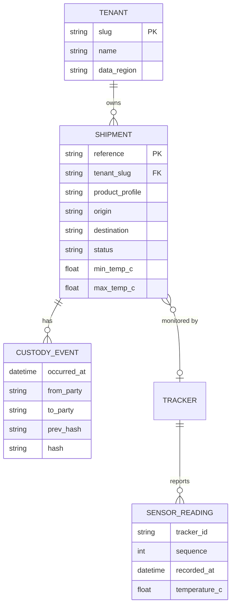

# Data model

Temperature limits are copied onto the shipment at creation time, so later changes to a product profile
never alter the evaluation of historical shipments.

Since v2.0 every shipment belongs to a tenant. Brumalink's own consignments use the `brumalink` tenant.
Sensor readings are partitioned monthly and retained for 5 years (ADR 0004).
