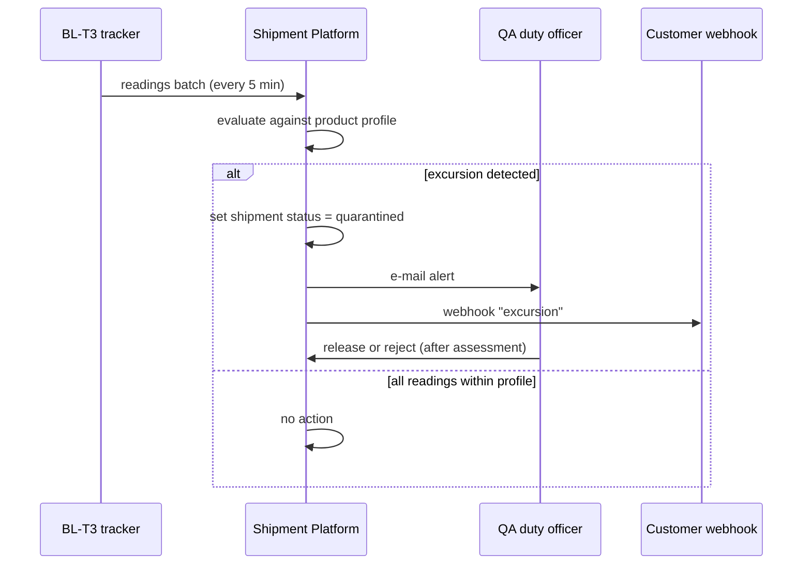

# Excursion alert flow

```mermaid
sequenceDiagram
    participant T as BL-T3 tracker
    participant P as Shipment Platform
    participant QA as QA duty officer
    participant C as Customer webhook

    T->>P: readings batch (every 5 min)
    P->>P: evaluate against product profile
    alt excursion detected
        P->>P: set shipment status = quarantined
        P->>QA: e-mail alert
        P->>C: webhook "excursion"
        QA->>P: release or reject (after assessment)
    else all readings within profile
        P->>P: no action
    end
```

QA must assess every quarantined shipment within 4 hours (SOP-TR-07 in `gdp-compliance-docs`).
