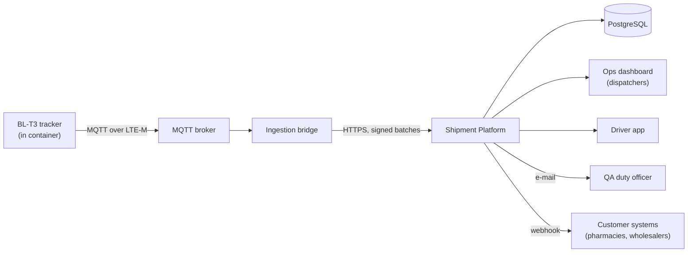

# System context

## Actors

- **Dispatchers** plan and monitor shipments in the ops dashboard.
- **Drivers** scan pickups and deliveries in the driver app; each scan becomes a custody event.
- **QA duty officer** is alerted on every excursion and releases or rejects quarantined shipments.
- **Customers** receive excursion webhooks and delivery confirmations.
