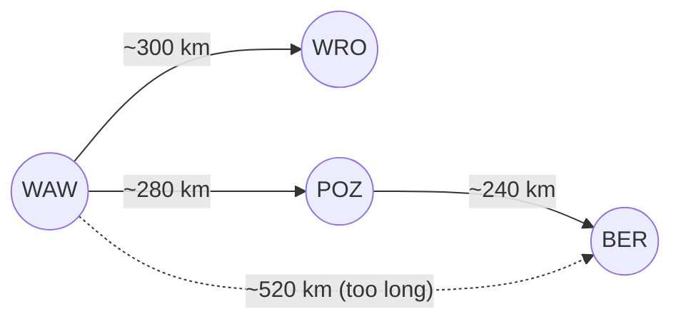

# Route planning

Replaces the route planner documented in `legacy-route-planner` (retired 2025).

## Rules

- Routes go hub to hub; the list of hubs is in [hubs.csv](hubs.csv).
- A single leg may not exceed **450 km** – one driver shift and within the passive-cooling autonomy of our containers.
- Among allowed routes, the one with the shortest total distance is chosen.

## Examples

| From | To | Route | Why |
|---|---|---|---|
| Warsaw | Wroclaw | WAW → WRO | ~300 km, direct |
| Warsaw | Berlin | WAW → POZ → BER | direct ~520 km exceeds the leg limit |

