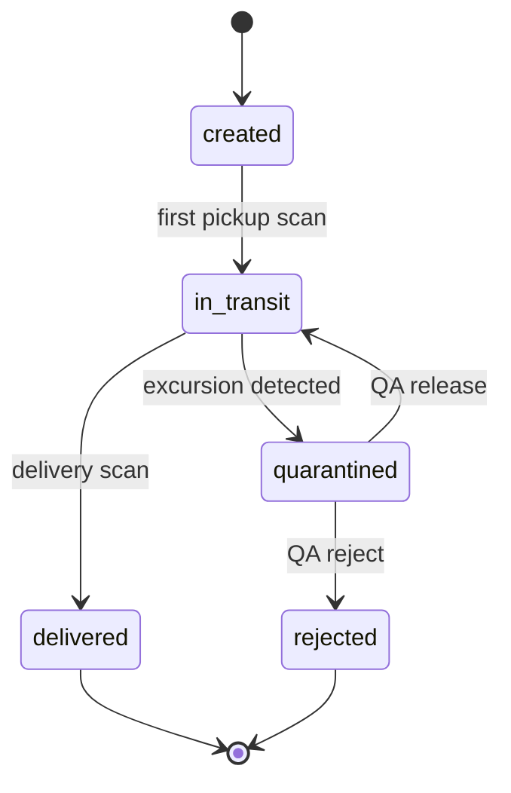

# Shipment lifecycle

| Status | Meaning |
|---|---|
| `created` | Booked, tracker assigned, not yet picked up |
| `in_transit` | Picked up; readings are evaluated continuously |
| `quarantined` | Excursion detected. The product must not be used until QA assesses it (SOP-TR-07) |
| `rejected` | QA rejected the product – return or destruction, deviation record required |
| `delivered` | Signed for by the consignee |

A shipment can be quarantined more than once. Every QA decision is recorded as a custody event.
