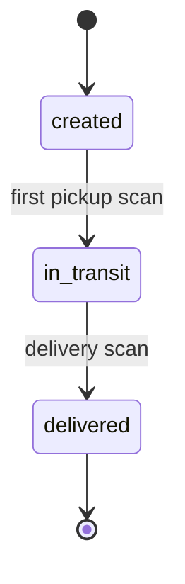

# Shipment lifecycle

| Status | Meaning |
|---|---|
| `created` | Booked, tracker assigned, not yet picked up |
| `in_transit` | Picked up; readings are evaluated continuously |
| `delivered` | Signed for by the consignee |
